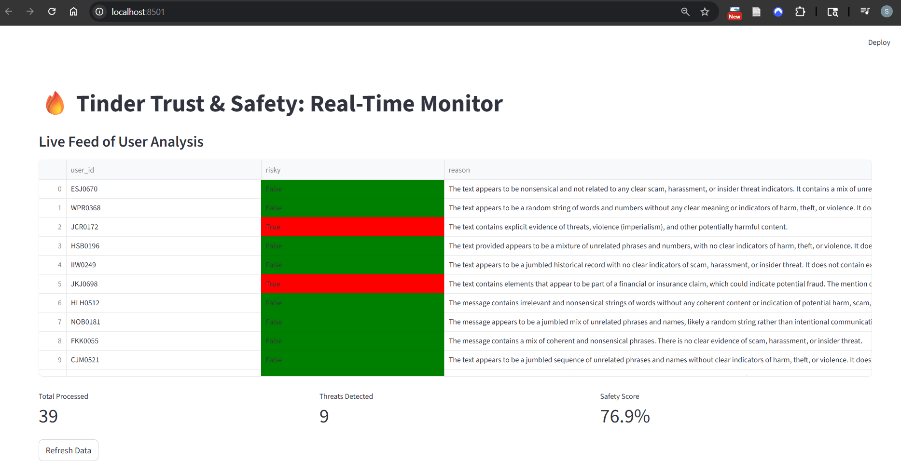

===============
tinder-pipeline
===============

.. image:: https://img.shields.io/badge/build-passing-brightgreen
   :target: https://github.com/sromerof202/ML-pipeline-using-a-local-LLM
.. image:: https://img.shields.io/badge/license-MIT-blue
   :target: https://github.com/sromerof202/ML-pipeline-using-a-local-LLM
.. image:: https://img.shields.io/badge/python-3.11-blue
   :target: https://www.python.org/

**Lightweight ML pipeline for high-volume threat detection using a local LLM.**

.. image:: rate_limit_grafana.png
   :alt: Grafana Metrics
   :align: center

Overview
========
`tinder-pipeline` is a scalable ML pipeline that automates high-volume threat detection using a Local LLM to ensure user privacy and zero data leakage.

It handles massive data spikes by ingesting logs via Apache Spark and buffering them through a Redis queue, allowing distributed workers to analyze messages for toxicity in parallel.

Finally, it serves real-time risk scores to the application via a FastAPI endpoint and monitors system health and detected threats using a live Grafana + UI dashboard.

Architecture
============
The system follows a decoupled Producer-Consumer pattern to handle backpressure during traffic spikes.

**Flow:**
Ingestion (Spark) -> Redis Queue -> Worker (Python) <-> Ollama (Qwen) -> Redis Feature Store -> FastAPI -> Grafana/UI

Key Features
~~~~~~~~~~~~
* **High-Volume Ingestion:** Uses **Apache Spark** logic to batch-process CSV logs into Redis.
* **Shock Absorber Pattern:** Implements a Redis Queue to buffer traffic.
* **Privacy-First AI:** Deploys quantized **Qwen 2.5 (3B)** models locally.
* **Resilience:** Implements "Poison Pill" protection.
* **Observability:** Full monitoring stack (**Prometheus & Grafana**).

Getting started
===============

1. Install dependencies and pre-commit hooks:

   .. code-block:: bash

      pip install -r requirements.txt
      pip install pre-commit
      cd tinder-pipeline
      pre-commit install
      pre-commit autoupdate

2. Start Ollama:

   .. code-block:: bash

      docker-compose up -d ollama

3. Pull a model (example):

   .. code-block:: bash

      docker-compose exec ollama ollama pull qwen2.5:3b

4. Start the pipeline:

   .. code-block:: bash

      docker-compose up -d --build

Files of interest
=================
- ``email.csv`` — input data used by the ingestor.
- ``src/tinder_pipeline/ingestor.py`` — reads CSV and enqueues tasks to Redis.
- ``src/tinder_pipeline/worker.py`` — worker that calls local LLM and writes risk results to Redis.
- ``src/tinder_pipeline/api.py`` — FastAPI service that returns per-user risk.
- ``prometheus.yml`` — Prometheus scrape configuration.

Prometheus example queries
==========================
- ``rate(emails_processed_total[1m])``
- ``increase(threats_detected_total[1m])``

Dataset reference
=================
Insider Threat Test Dataset: https://kilthub.cmu.edu/articles/dataset/Insider_Threat_Test_Dataset/12841247/1?file=24856766

Contributing
============
- Follow the pre-commit hooks listed above.
- Update tests and add unit tests for new features.
- Keep secrets and sensitive data off of logs — pipeline uses a local LLM to reduce data leakage risk.

Notes
=====
This project was scaffolded with PyScaffold 4.6. See https://pyscaffold.org/ for details.
